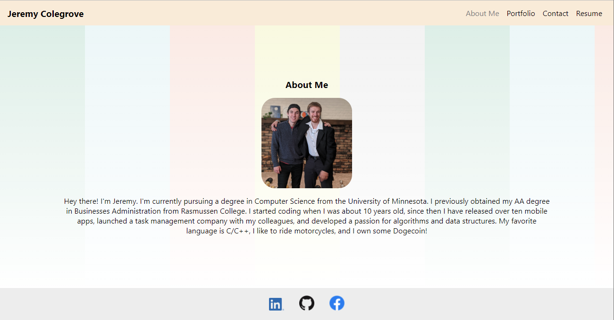
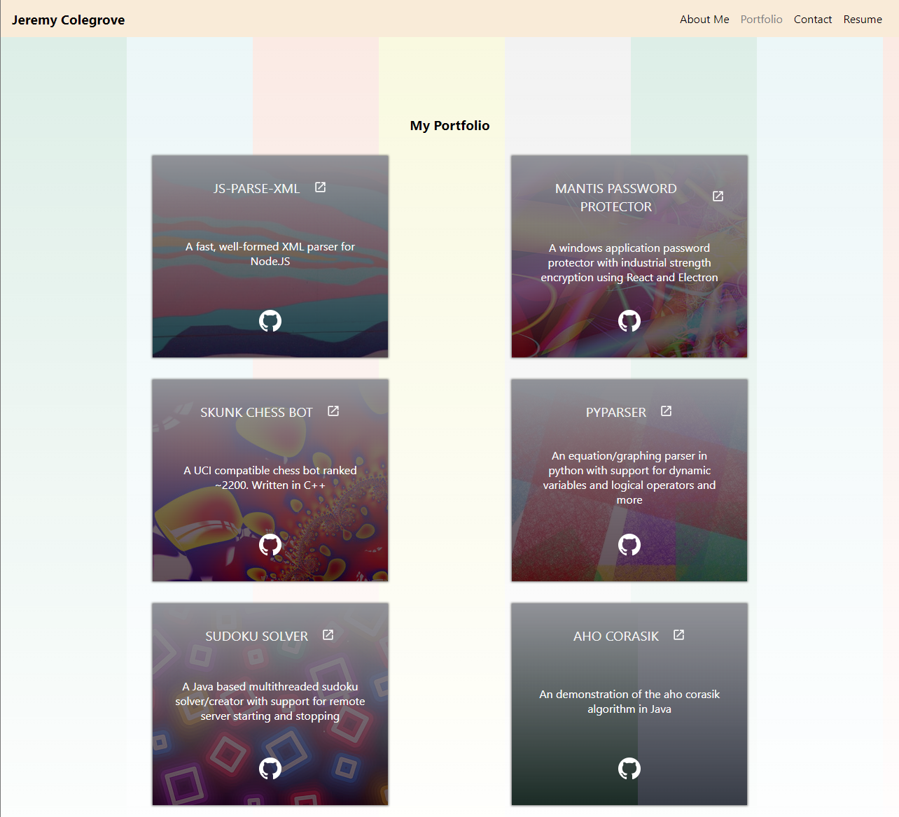

# Jeremy Colegroves Personal Website

## Description
Hey there! This is the repository for my personal website.

The website was created using React.JS, and will be improved upon further in subsequent updates! The website in total took seven hours to create. I wanted to make the design very fun and colorful!

The website is currently being hosted on Github pages, and you can view it by [clicking here](https://jeremycolegrove2u.github.io/jc-portfolio/).

## Screenshots

